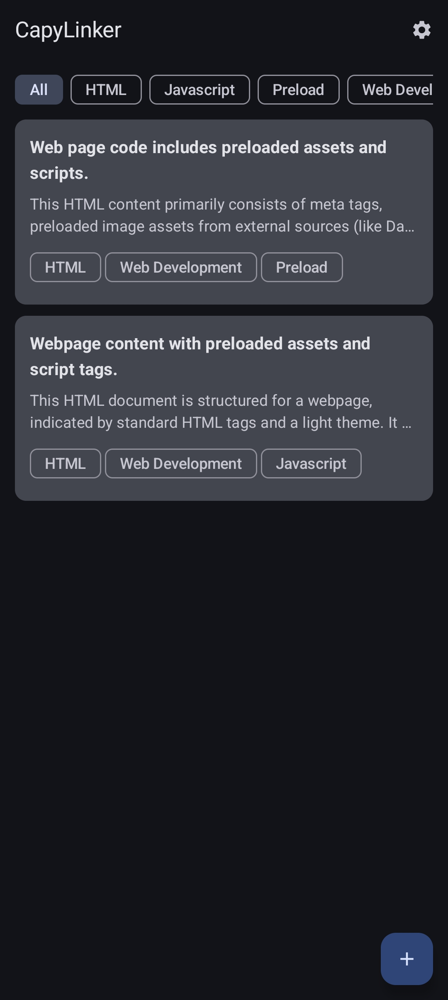
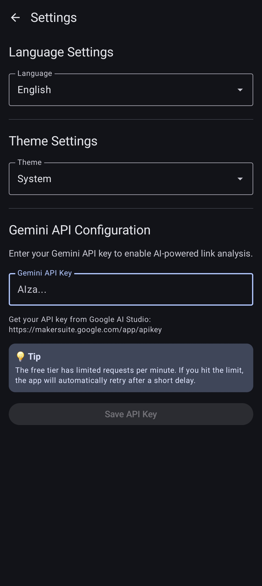

# CapyLinker

<p align="left">
  
</p>

**CapyLinker** is an intelligent link management Android app powered by Google's Gemini AI. Save, organize, and analyze your bookmarks with AI-generated summaries and smart tagging.

## ✨ Features

### 🤖 AI-Powered Analysis
- **Automatic Summarization**: Gemini AI analyzes web content and generates concise summaries
- **Smart Tagging**: Automatically extracts relevant keywords and tags from content
- **Title Extraction**: Intelligent title generation based on content analysis
- **Multi-language Support**: AI responds in your preferred language

### 📱 Core Functionality
- **Quick Link Saving**: Add links via in-app dialog or share menu
- **Background Processing**: Links are analyzed asynchronously without blocking the UI
- **Tag Filtering**: Filter saved links by tags for easy organization
- **Expandable Cards**: Tap to expand/collapse full summaries
- **Long Press Actions**: Quick access to copy, share, or delete links

### 🌍 Multi-language Support
The app supports 10 languages with full UI translation:
- English (default)
- Korean (한국어)
- Japanese (日本語)
- Simplified Chinese (简体中文)
- Traditional Chinese (繁體中文)
- Spanish (Español)
- French (Français)
- German (Deutsch)
- Russian (Русский)
- Portuguese (Português)

### 🎨 Customization
- **Theme Options**: System default, Light mode, or Dark mode
- **Language Settings**: Choose your preferred language
- **Persistent Settings**: All preferences are saved locally

### 🔒 Privacy & Security
- **100% Local Storage**: All your links, summaries, and tags are stored exclusively on your device
- **No Cloud Sync**: Your data never leaves your device
- **No Account Required**: Use the app without any registration or login
- **No Analytics**: We don't track or collect any user data
- **Secure API Key Storage**: API keys are encrypted using Android Keystore
- **Open Source**: Full transparency - inspect the code yourself

> **Your Privacy Matters**: CapyLinker is designed with privacy-first principles. The only external communication is with Google's Gemini API for content analysis, and only when you explicitly save a link.

## 📸 Screenshots

<p align="left">
  
  
</p>
## 🚀 Getting Started

### Prerequisites
- Android device/emulator running Android 7.0 (API 24) or higher
- Android Studio (for development)
- Google Gemini API key (free tier available)

### Installation

1. **Clone the repository**
   ```bash
   git clone https://github.com/yourusername/capylinker.git
   cd capylinker
   ```

2. **Open in Android Studio**
   - Launch Android Studio
   - Select "Open an Existing Project"
   - Navigate to the cloned repository

3. **Build and Run**
   - Sync Gradle files
   - Connect your Android device or start an emulator
   - Click "Run" or press `Shift + F10`

### Setting Up Gemini API

CapyLinker requires a Google Gemini API key to enable AI-powered features.

#### 1. Get Your API Key

1. Visit [Google AI Studio](https://makersuite.google.com/app/apikey)
2. Sign in with your Google account
3. Click **"Get API Key"** or **"Create API Key"**
4. Copy your API key (starts with `AIza...`)

#### 2. Configure in App

1. Open CapyLinker app
2. Tap the **Settings** icon (⚙️) in the top right
3. Scroll to **"Gemini API Configuration"**
4. Paste your API key in the text field
5. Tap **"Save API Key"**

> **💡 Tip**: The free tier allows 15 requests per minute. If you hit the rate limit, the app automatically retries after a short delay.

#### API Key Storage & Privacy
- ✅ Your API key is stored **locally** on your device only
- ✅ Encrypted using Android's secure DataStore
- ✅ Never transmitted to any server except Google Gemini API
- ✅ Never shared with third parties
- ✅ You can delete it anytime from Settings

**What data is sent to Gemini API?**
- Only the URL content when you save a link for analysis
- Your language preference (to get responses in your language)
- Nothing else - no personal data, no usage statistics

## 📖 Usage Guide

### Adding Links

#### Method 1: In-App
1. Tap the **+** (Floating Action Button)
2. Enter the URL
3. Tap **"Save"**
4. The link is analyzed in the background

#### Method 2: Share Menu
1. In any browser or app, tap the **Share** button
2. Select **"CapyLinker"** from the share menu
3. The link is automatically saved and analyzed

### Organizing Links

#### Filtering by Tags
- Tap any tag chip at the top of the screen
- Only links with that tag will be displayed
- Tap "All" to show all links

#### Viewing Details
- Tap a link card to expand/collapse the full summary
- Long press for quick actions (copy, share, delete)

### Managing Settings

Navigate to Settings (⚙️) to customize:
- **Language**: Choose your preferred language
- **Theme**: Light, Dark, or System default
- **API Key**: Update or change your Gemini API key

## 🛠️ Technology Stack

### Architecture
- **MVVM** (Model-View-ViewModel) architecture
- **Clean Architecture** principles
- **Dependency Injection** with Hilt/Dagger

### Libraries & Frameworks
- **Jetpack Compose**: Modern declarative UI toolkit
- **Kotlin Coroutines**: Asynchronous programming
- **Flow**: Reactive data streams
- **Room Database**: Local data persistence
- **DataStore**: Preferences and settings storage
- **Hilt**: Dependency injection
- **Google Generative AI SDK**: Gemini AI integration
- **Navigation Compose**: In-app navigation

### Key Components
