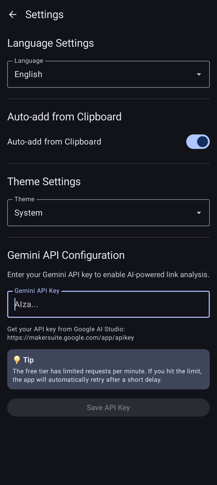
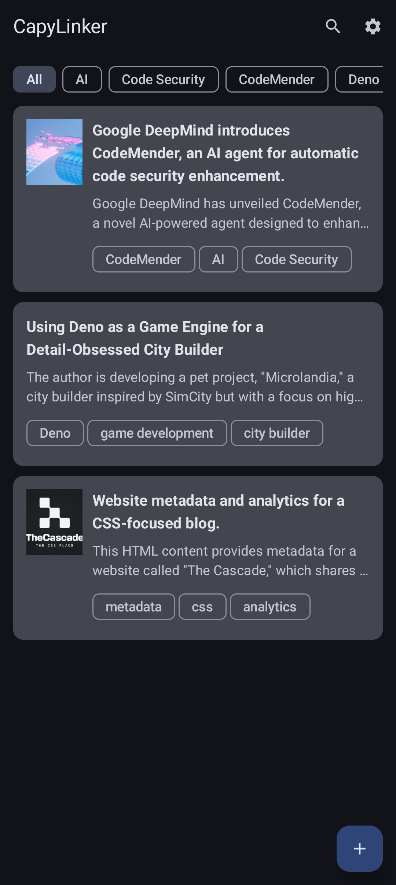
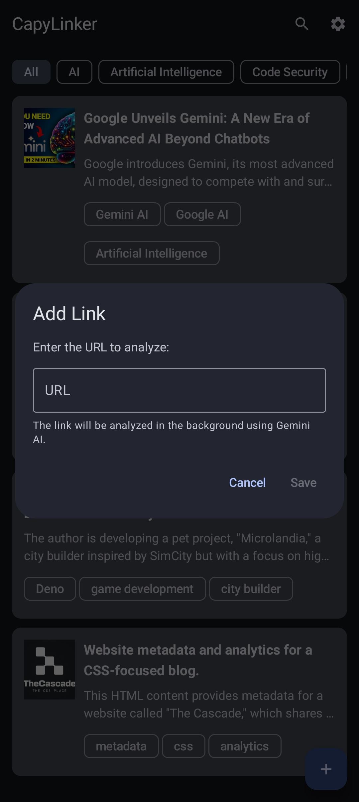
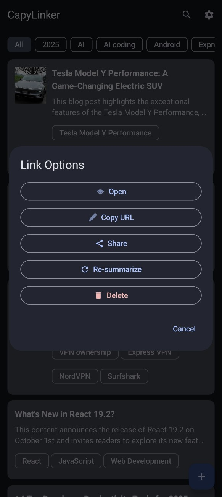

# CapyLinker

<p align="left">
  
</p>

<a href='https://play.google.com/store/apps/details?id=org.parkjw.capylinker&pcampaignid=pcampaignidMKT-Other-global-all-co-prtnr-py-PartBadge-Mar2515-1'></a>

**CapyLinker** is an intelligent link management Android app powered by Google's Gemini AI. Save, organize, and analyze your bookmarks with AI-generated summaries and smart tagging.

## ✨ Features

### 🤖 AI-Powered Analysis
- **Automatic Summarization**: Gemini AI analyzes web content and generates concise summaries
- **Smart Tagging**: Automatically extracts relevant keywords and tags from content
- **Title Extraction**: Intelligent title generation based on content analysis
- **YouTube Video Analysis**: Specialized support for YouTube videos with automatic title, description, and thumbnail extraction
- **Multi-language Support**: AI responds in your preferred language

### 📱 Core Functionality
- **Quick Link Saving**: Add links via in-app dialog or share menu
- **Clipboard Auto-Detection**: Automatically detects URLs in clipboard when opening the app (can be toggled in settings)
- **Background Processing**: Links are analyzed asynchronously without blocking the UI
- **Visual Thumbnails**: Automatically extracts and displays Open Graph images or representative thumbnails for each link
- **QR Code Generation**: Generate and share a QR code for any link, complete with an embedded app icon.
- **Unified Search**: Search across titles, summaries, URLs, and tags with real-time filtering
- **Tag Filtering**: Filter saved links by tags for easy organization
- **Expandable Cards**: Tap to expand/collapse full summaries
- **Link Options Menu**: Long-press on any link to access quick actions:
  - **Open**: Launch URL in default browser
  - **Copy URL**: Copy link to clipboard
  - **Share**: Share link via system share menu
  - **Share as QR Code**: Share a QR code image of the link.
  - **Re-summarize**: Re-run Gemini analysis to get a fresh summary
  - **Delete**: Remove link from collection

### 🌍 Multi-language Support
The app supports 10 languages with full UI translation:
- English
- Korean (한국어)
- Japanese (日本語)
- Simplified Chinese (简体中文)
- Traditional Chinese (繁體中文)
- Spanish (Español)
- French (Français)
- German (Deutsch)
- Russian (Русский)
- Portuguese (Português)

### 💾 Data Management
- **Backup & Restore**: Export all your data (links, settings, API key) to a JSON file
- **Complete Backup**: Single file contains everything - links, summaries, tags, thumbnails, and all settings
- **Easy Migration**: Transfer your data between devices or create safety backups
- **Timestamped Backups**: Automatic filename with date and time (e.g., `capyLinker-backup-202501151430.json`)

### 🎨 Customization
- **Theme Options**: System default, Light mode, or Dark mode
- **Language Settings**: Choose your preferred language (10 languages supported)
- **Gemini Model Selection**: Choose between Gemini 3.1 Flash-Lite and Gemini 3.5 Flash models
- **Clipboard Auto-Add**: Toggle automatic URL detection from clipboard
- **Persistent Settings**: All preferences are saved locally

### 🔒 Privacy & Security
- **100% Local Storage**: All your links, summaries, and tags are stored exclusively on your device
- **No Cloud Sync**: Your data never leaves your device (backup files are stored locally)
- **No Account Required**: Use the app without any registration or login
- **No Analytics**: We don't track or collect any user data
- **Secure API Key Storage**: API keys are encrypted using Android Keystore
- **User-Controlled Backups**: Backup files are created only when you request them and stored where you choose
- **Open Source**: Full transparency - inspect the code yourself

> **Your Privacy Matters**: CapyLinker is designed with privacy-first principles. The only external communication is with Google's Gemini API for content analysis, and only when you explicitly save a link. Backup files are JSON format and stored locally - you have complete control over your data.

## 📸 Screenshots

<p align="left">
  
  
  
  
</p>

## 🚀 Getting Started

### Prerequisites
- Android device/emulator running Android 15 (API 35) or higher
- Android Studio (for development)
- JDK 25 for Gradle builds (the Android app bytecode target remains Java 17)
- Google Gemini API key (free tier available)

### Installation

1. **Clone the repository**
   ```bash
   git clone https://github.com/yourusername/capylinker.git
   cd capylinker
   ```

2. **Open in Android Studio**
   - Launch Android Studio
   - Select "Open an Existing Project"
   - Navigate to the cloned repository

3. **Build and Run**
   - Sync Gradle files
   - Connect your Android device or start an emulator
   - Click "Run" or press `Shift + F10`
   - CLI builds use Gradle 9.1.0 with JDK 25:
     ```bash
     ./gradlew :app:assembleDebug
     ```

### Setting Up Gemini API

CapyLinker requires a Google Gemini API key to enable AI-powered features.

#### 1. Get Your API Key

1. Visit [Google AI Studio](https://makersuite.google.com/app/apikey)
2. Sign in with your Google account
3. Click **"Get API Key"** or **"Create API Key"**
4. Copy your API key (starts with `AIza...`)

#### 2. Configure in App

1. Open CapyLinker app
2. Tap the **Settings** icon (⚙️) in the top right
3. Scroll to **"Gemini API Configuration"**
4. Paste your API key in the text field
5. **Select your preferred Gemini model**:
   - **Gemini 3.5 Flash** (Default): Best balance for link summaries and tagging
   - **Gemini 3.1 Flash-Lite**: Fast, cost-conscious option for lightweight summaries
6. Tap **"Save API Key"**

> **💡 Tip**: The free tier allows 15 requests per minute. If you hit the rate limit, the app automatically retries after a short delay.

#### API Key Storage & Privacy
- ✅ Your API key is stored **locally** on your device only
- ✅ Encrypted with Android Keystore before being stored in DataStore
- ✅ Never transmitted to any server except Google Gemini API
- ✅ Never shared with third parties
- ✅ You can delete it anytime from Settings

**What data is sent to Gemini API?**
- Only the URL content when you save a link for analysis
- For YouTube videos: video title, description, and metadata
- Your language preference (to get responses in your language)
- Nothing else - no personal data, no usage statistics

### YouTube Video Support

CapyLinker has special handling for YouTube links:
- Automatically detects YouTube URLs (youtu.be, youtube.com/watch, youtube.com/embed)
- Extracts video title and description from YouTube metadata
- Displays high-quality video thumbnail
- Gemini AI analyzes the video information to generate summary and tags
- Works seamlessly like any other link

## 📖 Usage Guide

### Adding Links

#### Method 1: In-App
1. Tap the **+** (Floating Action Button)
2. Enter the URL
3. Tap **"Save"**
4. The link is analyzed in the background

#### Method 2: Share Menu
1. In any browser or app, tap the **Share** button
2. Select **"CapyLinker"** from the share menu
3. The link is automatically saved and analyzed

#### Method 3: Clipboard Auto-Detection
1. Copy any URL to your clipboard
2. Open CapyLinker
3. A dialog will appear asking if you want to add the URL
4. Tap **"Add"** to save the link
   - Can be disabled in Settings if not needed

### Finding & Organizing Links

#### Unified Search
1. Tap the **🔍 Search** icon in the top bar
2. Type your search query
3. Results filter in real-time across:
   - Link titles
   - Summaries
   - URLs
   - Tags
4. Press **back** or tap **✕** to exit search mode

#### Filtering by Tags
- Tap any tag chip at the top of the screen
- Only links with that tag will be displayed
- Tap "All" to show all links
- Search and tag filters work together for precise results

#### Viewing Details
- Tap a link card to expand/collapse the full summary
- **Thumbnails** are displayed automatically for visual recognition
- Long press to open the **Link Options Menu**

### Link Options Menu

Long-press any link to access quick actions:
- **Open**: Opens the URL in your default browser
- **Copy URL**: Copies the link to clipboard
- **Share**: Share via system share menu
- **Share as QR Code**: Share a QR code image of the link.
- **Re-summarize**: Re-run Gemini analysis to get a fresh summary
- **Delete**: Removes the link from your collection

### Backup & Restore

#### Creating a Backup

1. Open **Settings** (⚙️)
2. Scroll to **"Backup & Restore"** section
3. Tap **"Create Backup"**
4. Choose a location to save the backup file
5. Your backup file is created with timestamp: `capyLinker-backup-YYYYMMDDHHMM.json`

**What's included in the backup?**
- All saved links with titles, summaries, and tags
- Thumbnail URLs
- Gemini API key
- Selected Gemini model
- Language preference
- Theme setting
- Clipboard auto-add preference

#### Restoring from Backup

1. Open **Settings** (⚙️)
2. Scroll to **"Backup & Restore"** section
3. Tap **"Restore Backup"**
4. Select your backup JSON file
5. All data will be restored and overwrite existing data
- A success message will appear when complete

> **⚠️ Warning**: Restoring a backup will **replace all existing data**. Make sure to create a backup of your current data before restoring if you want to keep it.

**Use Cases for Backup:**
- 📱 **Device Migration**: Moving to a new phone
- 🔄 **Multiple Devices**: Keep data in sync across devices
- 💾 **Safety Backup**: Regular backups to prevent data loss
- 🧪 **Testing**: Try different configurations without losing data

### Managing Settings

Navigate to Settings (⚙️) to customize:
- **Language**: Choose your preferred language (10 languages available)
- **Theme**: Light, Dark, or System default
- **Clipboard Auto-Add**: Enable/disable automatic URL detection
- **Gemini Model**: Select which AI model to use for analysis
- **API Key**: Update or change your Gemini API key
- **Backup & Restore**: Export or import your data

### Back Button Behavior

For a better user experience:
- **In Search Mode**: Back button exits search
- **In Link List**: Press back twice within 2 seconds to exit the app
  - First press shows a toast message
  - Second press closes the app
- **With Dialogs Open**: Back button closes the dialog
